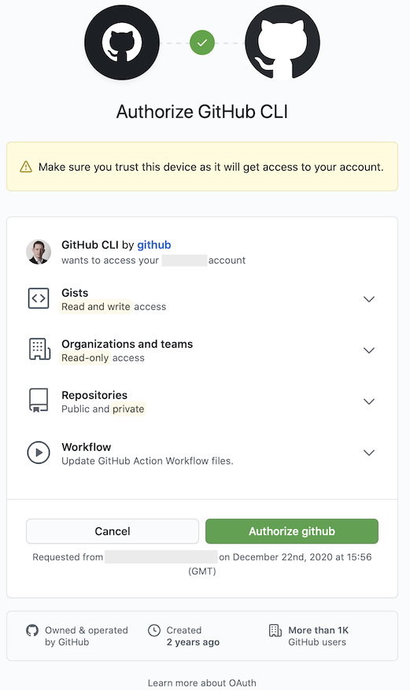

#Using GitHub CLI to create a repo

**Author:** [Alan Mills]
**Date:** [22 December 2020 15:43]
**Tags:** [GitHub]
**Status**: Draft

The GitHub CLI (gh) enables you to manage GitHub from the command line.

This article walks you through installing and setting up GitHub CLI, and then from the command line creating a new git repo and pushing it to GitHub.

1. Install GitHub CLI
2. Set-up GitHub CLI
3. Create a GitHub Repo
4. Create a local git repo
5. initialise and push local git repo to GitHub

## Install GitHub CLI

```bash
brew install gh
```  

## Set-up GitHub CLI

1. Login to github.com
2. Login and Authorise GitHub CLI to access your github.com account
3. Configure GitHub CLI Protocol

Using your default browser, log in to (github.com) using the account you want to use with the GitHub CLI.

```bash
gh auth log in
? What account do you want to log into? GitHub.com
- Logging into github.com
? How would you like to authenticate? Login with a web browser

! First copy your one-time code: 46A9-ELD4
```

Authorise GitHub CLI to access your github.com account
<br />


```bash
Authentication complete. Press Enter to continue

? Choose default git protocol SSH
- gh config set -h github.com git_protocol ssh
Configured git protocol
Logged in as alan_company1
```

## Create GitHub Repo

```bash
gh repo create --private -y -d 'My cool project 22 December 2020' my-cool-project
```

## Initialise and push a new local repo to Github

### Initialise a new git repo

```bash
md my-cool-project
cd my-cool-project
echo '# my-cool-project` >> README.md
git init
git add README.md
git commit -m "first commit"
```

### Rename master branch to main

```bash
git branch -M main
```

### Configure the main branch to push to GitHub

```bash
git remote add origin git@github.com:company1/my-cool-project
git remote add origin git@github_company1:company1/my-cool-project
git push -u origin main
```

## References

* [GitHub CLI](https://cli.github.com)
  * [gh auth log in](https://cli.github.com/manual/gh_auth_log)
  * [gh repo create](https://cli.github.com/manual/gh_repo_create)
